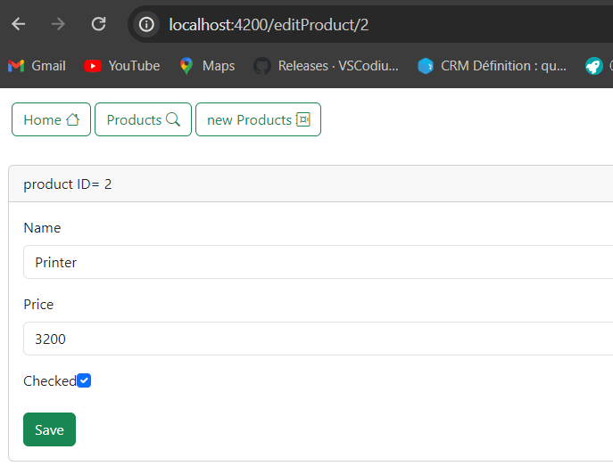

<h1>Capture1: affichage du 1er composant<h1>

<h1>Capture2: affichage d'un produit selon son id <h1>

<h1>Capture3: affichage des produits <h1>

<h1>Capture4: Affichage de tout les produits après le test de chacked<h1>

<h1>Capture5: Test avec type script<h1>

<h1>Capture6: Ajout des boutons d'action delete et un alert<h1>

<h1>Capture7: Ajout de formulaire de la creation des produits<h1>

<h1>Capture8: Test de la creation d'un produit <h1>

<h1>Capture9: Formulaire d'ajout<h1>

<h1>Capture10: Test d'affichage des pages avec "http://localhost:8089/products?_page=1&_limit=2"<h1>

<h1>Capture11: Ajout de l'icone modifier<h1>

<h1>Capture12: Recuperation des information d'un produit et les afficher dans le formulaire de modification<h1>

<h1>Capture13: Test du modification d'un produit <h1>

<h1>Capture14: Affichage du produit modifié<h1>

<h1>Capture15: Ajout de la pagination et test de navigation entre les pages existantes <h1>

<h1>Capture16: Ajout d'un card pour afficher le nombre total des page, la taille des produits par page, nombre total des produits et le nombre des produits avec la valeur de checked=true<h1>

<h1>Capture E1:Captures des erreurs rencontré lors de la réalisation du projet: (absence du 'x-total-count' pour faire la pagination ) cette probleme à été resolu en utilisant des fonctions pour recuperer la taille du produit (getProducts) depuis le productService<h1>

# EnsetApp

This project was generated with [Angular CLI](https://github.com/angular/angular-cli) version 17.2.2.

## Development server

Run `ng serve` for a dev server. Navigate to `http://localhost:4200/`. The application will automatically reload if you change any of the source files.

## Code scaffolding

Run `ng generate component component-name` to generate a new component. You can also use `ng generate directive|pipe|service|class|guard|interface|enum|module`.

## Build

Run `ng build` to build the project. The build artifacts will be stored in the `dist/` directory.

## Running unit tests

Run `ng test` to execute the unit tests via [Karma](https://karma-runner.github.io).

## Running end-to-end tests

Run `ng e2e` to execute the end-to-end tests via a platform of your choice. To use this command, you need to first add a package that implements end-to-end testing capabilities.

## Further help

To get more help on the Angular CLI use `ng help` or go check out the [Angular CLI Overview and Command Reference](https://angular.io/cli) page.
